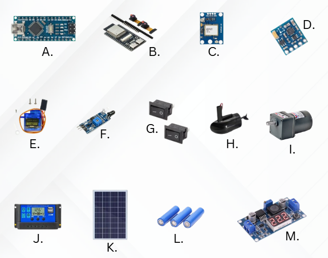
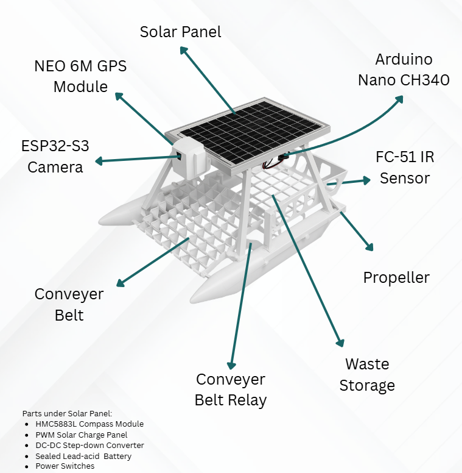
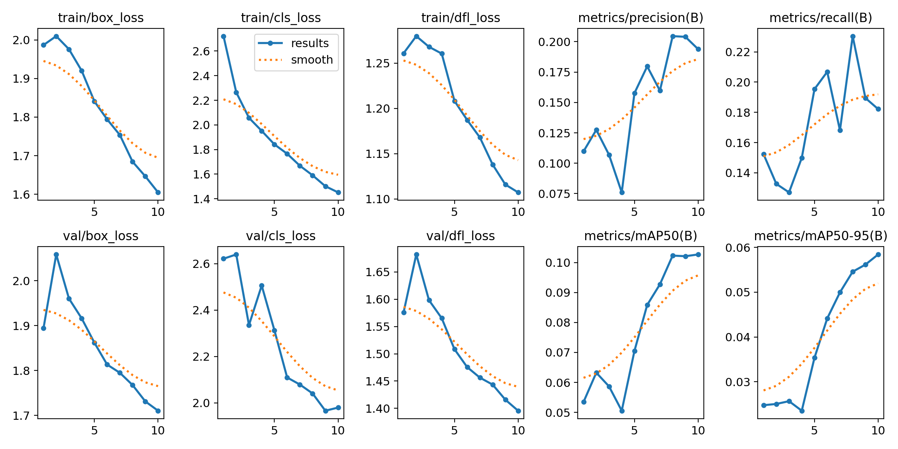
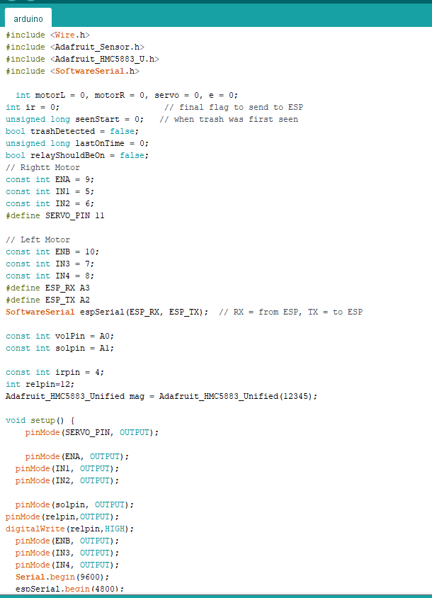
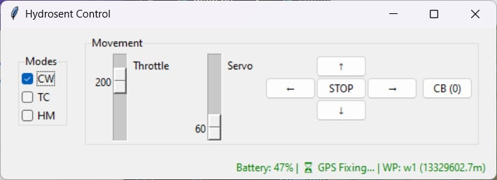

# 🌊 HydroSent: AI-Integrated Autonomous Surface Vessel
**User Manual & Technical Documentation**

HydroSent is an advanced autonomous floating robot designed for real-time aquatic debris detection and collection. Utilizing an AI-driven conveyor belt system and solar-harvesting technology, HydroSent provides a sustainable, long-endurance solution for water body maintenance.

---

## 🛠️ 1. Hardware Architecture & Integration
HydroSent utilizes a dual-processor architecture to balance low-level motor control with high-level computer vision.

### System Components

| ID | Component | Primary Function |
| :--- | :--- | :--- |
| **A** | **Arduino Nano** | Master controller for logic and sensor-actuator hardware loop. |
| **B** | **ESP32-S3 Camera** | Handles high-speed camera streaming and AI Wi-Fi communication. |
| **C** | **NEO-6M GPS Module** | Provides real-time geospatial coordinates for waypoint tracking. |
| **D** | **HMC5883L Compass** | Magnetometer for precise orientation and heading control. |
| **E** | **Motor Driver** | Manages power distribution to the propulsion propellers. |
| **F** | **FC-51 IR Sensors** | Infrared proximity detection for automated obstacle avoidance. |
| **I** | **Conveyor Belt Relay** | Controls the high-torque motor used to scoop and transport waste. |
| **J** | **PWM Solar Controller**| Manages safe energy transfer from solar panels to the battery. |
| **K** | **Solar Panel** | Renewable energy source for extended autonomous deployment. |
| **L** | **Lead-Acid Battery** | Primary energy storage for 24/7 mission capability. |
| **M** | **DC/DC Step Down** | Precision voltage regulation for sensitive onboard electronics. |

### Visual Integration Map

*Figure 1: Full assembly view showing component placement and the conveyor-belt mechanics.*

---

## 🤖 2. Firmware & AI Training
The "intelligence" of HydroSent is built on a custom-trained model designed to differentiate between organic water elements and synthetic trash.

### AI Model Development
* **Dataset Generation:** Utilizes a curated image library (`dataset.png`) of aquatic debris.
* **Training Results:** The model is optimized using PyTorch, achieving high precision in dynamic lighting conditions.

### Core Firmware logic
* **`arduino.ino`**: Manages the hardware interrupt service routines for sensors and motors.
* **`main.py`**: Executes the high-level AI detection and Wi-Fi data streaming.

---

## 🖥️ 3. Software Control & Telemetry
Users can monitor and control HydroSent via a specialized desktop application or web dashboard.

* **Real-Time Logs:** Monitor system health and GPS coordinates through the `logs.png` interface.
* **Manual Override:** The `main7.exe` dashboard allows for direct propulsion control and conveyor activation.
* **Visual Verification:** View live AI detection frames (`detected-trash.png`) to confirm collection efficiency.

---

## 📐 4. Engineering Design
HydroSent was developed through rigorous CAD modeling to ensure buoyancy and structural integrity.

* **3D Modeling:** Built using AutoCAD and SolidWorks to calculate optimal weight distribution. (`main-model.png`)
* **PCB Design:** Custom-etched `pvc-main-board.png` for a clean, interference-free circuit layout.

---

## 📂 5. Project Documentation
For the full technical schematic and maintenance schedules, refer to the primary document:

* 📄 [Download Full HydroSent User Manual (PDF)](HydroSent-User-Manual.pdf)

---
**Lead Developer:** John Ivan Ello | 2026
*Specializing in IoT, Robotics, and Computer Vision*
